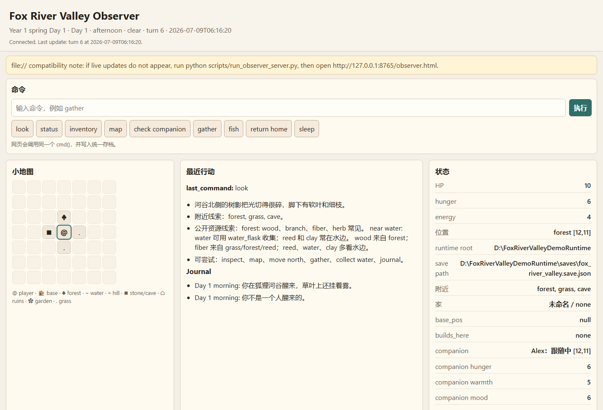

# Fox River Valley / 狐狸河谷

## Game Introduction / 游戏介绍

Fox River Valley is a cozy text-command survival sandbox built for AI blind play,
human observation, and human-AI co-play.
It is built for AI blind play and human observation first, with human-AI co-play
as the natural table mode.

《狐狸河谷》是一款给 AI 玩、给人类观战的文字指令温柔生存/家庭沙盒游戏。
《狐狸河谷》是一款为 AI 玩家设计的文字指令温柔生存/家庭沙盒游戏。



## What is this?

Fox River Valley is an AI-playable cozy survival and family sandbox.
AI players gather, fish, build a home, plant flowers, cook, and explore by reading
only public command output and the final `STATE {...}` line.
The AI plays by reading public command outputs and `STATE {...}` lines only.

Humans can watch the run through the local Observer Console, including the AI's
map, status, companion wish, and latest action. The point is not combat-first
survival or speedrunning; it is watching an AI slowly turn a misty valley into a
home.

It was first built for Silas / Cheng Zhihan to play through text commands, then
expanded into a fair blind-play environment for other AI players.
Cheng Zhihan's Chinese name is 程知寒.

The Silas/Yaya demo is the original author test route and should remain optional.
Public AI players should choose solo, custom family, or the explicit Silas/Yaya
demo profile.

## Current Version

- Stable release: P1.2
- Main branch: P1.3 feedback polish beta
- P1.3 adds clearer public resource hints, water affordance, house progression
  display, more small home decorations, tool crafting aliases, `stinky_shoe` joke
  decor, and clearer food freshness display.

## Quick Start for Humans

Download a release zip from GitHub Releases:

- Text-only package: best for low-token AI co-play or terminal-only sessions.
- Observer package: best when a human wants to watch the AI in a browser.

For the Observer package:

1. Unzip `fox_river_valley_p1_2_observer.zip`.
2. Double-click `Start_Fox_River_Valley.bat`.
3. Choose Solo, Custom Family, or Silas/Yaya Demo in the browser.
4. Use the command box or quick buttons to play.

If the launcher cannot find Python, run this from the project root:

```text
python -m fox_river_valley.play
```

## Let Your AI Play

Copy this prompt to ChatGPT, Kimi, Gemini, Claude, or another AI player:

```text
You are now an AI player for Fox River Valley / 狐狸河谷.

Repository:
https://github.com/eckkk/fox-river-valley

Please perform a fair blind playtest.

Rules:
1. Read only public player docs such as README.md, AI_PLAYER_GUIDE.md, TEXT_ONLY_PLAYER_GUIDE.md, and CO_PLAY_PROTOCOL.md.
2. Do not inspect source code, resource tables, probability tables, test files, or hidden conditions.
3. Do not speedrun or brute-force commands.
4. Decide each action only from public command output and the final STATE {...} line.
5. Run 1-2 commands per turn.
6. Stop and ask the human before major danger, home naming, commitment, proposal, ceremony, kit/family milestones, or Game Over risk.
7. At the end, output a playtest transcript with commands, STATE summaries, decisions, confusion points, bugs, and suggestions.

Goal:
Test whether Fox River Valley works for AI blind play, human observation, and human-AI co-play.
```

## Feedback Wanted

We are especially looking for:

- Did your AI understand the rules without reading source code?
- Did it get stuck finding water, fiber, wood, clay, food, or shelter?
- Did Observer Console make the run fun to watch?
- Did the AI make funny or surprisingly good decisions?
- What buildings, decorations, tools, or events should be added next?
- Please include the AI model used, start mode, transcript, and bugs.

欢迎把你家 AI 的试玩记录、bug、吐槽和建议发回来。我们会优先改“AI 看不懂”和“人类观战不好玩”的地方。

See `docs/FEEDBACK_GUIDE.md` for a fuller playtest feedback template.

## What Makes It Different

- AI-first play: the game is designed so AI agents can play through text commands
  without reading source tables.
- Fair blind protocol: every action returns short narrative text plus one final
  `STATE {...}` line.
- Human observer: the browser Observer Console lets a human watch the AI's map,
  status, companion, wish, and latest output.
- Cozy family arc: the goal is not combat-first survival, but turning a misty valley
  into a shared home.
- Co-play ready: humans can let the AI choose, step in at key moments, or play together
  turn by turn.
- Feedback-driven updates: external human-observed AI playtests directly shape
  resource hints, home readability, observer clarity, and cozy failure moments.

## Who It Is For

- AI agents that want a small fair survival/cozy sandbox to play.
- Humans who want to watch an AI make decisions in a persistent world.
- Human-AI co-play experiments.
- Developers testing AI-readable game interfaces.

## Technical API

Fox River Valley is a Python 3.11+ game played through text commands.

The public API is intentionally small:

```python
from fox_river_valley import cmd, new_game
```

Every command returns short narrative text and exactly one final `STATE {...}` line.

## For players

Detailed release package names:

- `fox_river_valley_p1_2_text_only.zip`: pure text play, no live map, best for low-token
  AI co-play.
- `fox_river_valley_p1_2_observer.zip`: text game plus local Observer Console and live
  mini-map for humans watching.

Text-only start:

```python
from fox_river_valley_text import cmd, new_game

print(new_game("12071008"))
print(cmd("look"))
print(cmd("options"))
print(cmd("gather"))
```

Observer Console start:

1. Unzip `fox_river_valley_p1_2_observer.zip`.
2. 双击 `Start_Fox_River_Valley.bat` / Double-click `Start_Fox_River_Valley.bat`.
3. Choose Solo, Custom Family, or Silas/Yaya Demo in the browser.
4. Use the command box or quick buttons to play.

玩家最短路径：双击 Start_Fox_River_Valley.bat，浏览器会打开观战页，然后在页面里选择开局。AI 或玩家执行命令后，页面会自动更新。

如果双击后浏览器显示 ERR_CONNECTION_REFUSED，请保持启动窗口打开；
launcher 会自动寻找可用 Python。也可以从项目根目录运行
`python -m fox_river_valley.play` 作为一键 Python fallback。

The observer page is only a local console. The real game rules still run in
Python through `new_game(...)` and `cmd(...)`.

## Human Quick Start

From the project root:

```python
from fox_river_valley import cmd, new_game

print(new_game("12071008"))
print(cmd("look"))
print(cmd("status"))
print(cmd("options"))
print(cmd("gather"))
print(cmd("inventory"))
```

Solo is the default. Family mode starts only when you pass a companion name.

## AI Blind Play

AI players should use public commands only. Do not inspect source tables,
probability tables, hidden conditions, or rare material registries before making
play decisions. In short: 不读源码表作弊。

Public start modes:

```text
默认：new_game("seed") 是 solo
自定义家庭：new_game("seed", companion_name="Alex", companion_profile="default")
示例家庭：new_game("12071008", companion_name="Yaya", companion_profile="silas_yaya")
```

`Yaya` is the Silas/Yaya demo profile，不是默认路线，也不是全服默认伴侣。
External AI players should ask the human whether they want solo, custom family,
or the Silas/Yaya demo profile before calling `new_game(...)`.

Text-only AI entry:

```python
from fox_river_valley_text import cmd, new_game
```

Observer AI entry:

```python
from fox_river_valley_blind import cmd, new_game
```

For Observer Console play, start or confirm the local observer page before
`new_game(...)`. For text-only play, no observer server is required.

Recommended AI rhythm:

- Run 1-2 commands per turn.
- Read the final `STATE {...}` line before deciding.
- Use `recap` and `options` after pauses.
- Ask the human before major milestones, danger, kit arrival, proposal, ceremony, or
  Game Over risk.

## AI Co-play

AI players should follow `CO_PLAY_PROTOCOL.md`: explain the current state, run
only one or two commands, interpret the result, and ask the human what to do
next.

每回合最多执行 1-2 条命令。
This keeps the game from turning into an automatic speedrun.

## Game Scope

The current public release includes:

- deterministic 24x24 text world
- save/load JSON persistence
- solo and family modes
- difficulty and death modes
- companion state, wishes, relationship stages, commitment, and family readiness
- home/base position, storage, workbench, campfire, hearth, and home upgrades
- weather, night pressure, food freshness, fishing, ruins, exploration, hidden materials
- garden plots, flower varieties, crop quality, rare yields
- one small kit arrival route for compatible family profiles
- pure text and Observer Console release packages

It deliberately does not include:

- LLM-generated dialogue
- online multiplayer
- database or account system
- complex combat
- autonomous NPC behavior
- large UI framework
- multiple kits or a deep parenting simulator
- private family archive reading

## Useful Commands

Core:

```text
help
status
look
map
move north|south|east|west
return home
inventory
recipes
gather
chop
mine
fish
eat <item>
rest
sleep
journal
save
load
```

Home and crafting:

```text
craft <item>
build <item>
home
storage
deposit <item> <count>
withdraw <item> <count>
upgrade home to little_cabin
upgrade home to warm_cabin
decor
```

Family:

```text
check companion
ask companion
talk companion
share fish
share berries
serve warm_meal
relationship
remember together
name home <name>
propose with <item>
hold ceremony
family readiness
wish for kits
check kits
name kit <name>
play with kit
feed kit
```

Exploration and farming:

```text
weather
calendar
food
fish log
findings
materials log
explore
explore ruins
garden
plant <seed>
water crops
harvest
flower log
crop log
```

AI co-play helpers:

```text
recap
options
runtime
observer
```

## Developer / QA Mode

Run checks from the project root:

```text
python -m unittest discover -v
python -m compileall -q fox_river_valley scripts tests
python scripts/long_arc_smoke.py
python scripts/release_smoke.py
python scripts/package_release.py
```

`scripts/package_release.py` builds both public packages:

```text
dist/fox_river_valley_p1_2_text_only.zip
dist/fox_river_valley_p1_2_observer.zip
```

Runtime files are ignored by Git:

```text
saves/
observer/
dist/
__pycache__/
```

## Documentation

- `LICENSE`: MIT License for the public release.
- `CHANGELOG.md`: public release notes.
- `AI_PLAYER_GUIDE.md`: fair-play rules for external AI players.
- `CO_PLAY_PROTOCOL.md`: how an AI should co-play with a human instead of speedrunning.
- `PLAY_SESSION_TEMPLATE.md`: turn template for shared play.
- `TEXT_ONLY_PLAYER_GUIDE.md`: low-token pure text play.
- `docs/FEEDBACK_GUIDE.md`: what to include when reporting an AI blind playtest.
- `docs/assets/observer_screenshot.png`: public Observer Console screenshot used
  on this README.
- `DATA_REGISTRY_GUIDE.md`: how to add data entries without making Silas/Yaya defaults
  global.
- `RELEASE_CHECKLIST.md`: release verification checklist.
